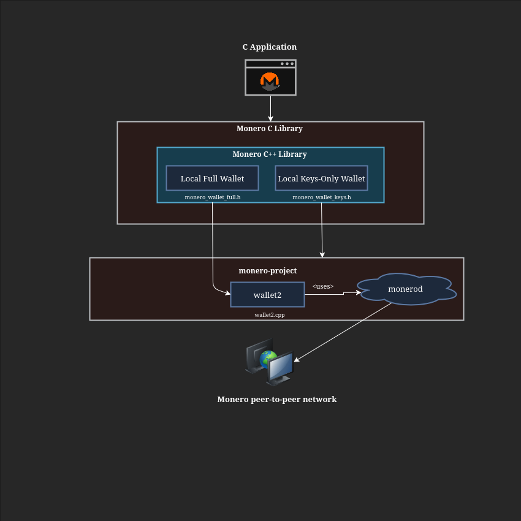

# libmonero
[](https://github.com/everoddandeven/monero-python/actions/workflows/build.yml)

A C API for creating Monero applications using a bridge to [monero v0.18.4.2 'Fluorine Fermi'](https://github.com/monero-project/monero/tree/v0.18.4.2).

* Supports client-side wallets using C API.
* Supports multisig, view-only, and offline wallets.
* Wallet types are interchangeable by conforming to a [common interface](https://woodser.github.io/monero-java/javadocs/monero/wallet/MoneroWallet.html).
* Uses a clearly defined [data model and API specification](https://woodser.github.io/monero-java/monero-spec.pdf) intended to be intuitive and robust.
* Query wallet transactions, transfers, and outputs by their properties.
* Receive notifications when wallets sync, send, or receive.

## Architecture

<p align="center">
	<br>
	<i>Build C
     applications using C API bindings to <a href="https://github.com/monero-project/monero">monero-project/monero</a>.  Wallet implementations are interchangeable by conforming to a common interface, <a href="https://woodser.github.io/monero-java/javadocs/monero/wallet/MoneroWallet.html">MoneroWallet</a>.</i>
</p>


## Sample code

```C
#include <monero_utils_bridge.h>
#include <monero_wallet_bridge.h>

int main(void) {
    // create wallet from mnemonic phrase using C API to monero-project

    char* config = "{\n"
        "\"path\": \"sample_wallet_full\",\n"
        "\"password\": \"supersecretpassword123\",\n"
        "\"networkType\": 2,\n"
        "\"server\": { \"uri\": \"http://localhost:38081\" },\n"
        "\"seed\": \"hefty value scenic...\",\n"
        "\"restoreHeight\": 553433 \n"
        "}";
    
    void* wallet = monero_wallet_full_create_wallet(config);

    // get wallet address and keys
    const char* primary_address = monero_wallet_get_primary_address(wallet);
    const char* private_view_key = monero_wallet_get_private_view_key(wallet);
    const char* seed = monero_wallet_get_seed(wallet);

    bool is_valid = monero_utils_is_valid_mnemonic(seed);

    // sync wallet

    monero_wallet_sync(wallet);

    // get wallet balance

    uint64_t balance = monero_wallet_get_balance(wallet);

    // save and close wallet

    monero_wallet_close(wallet, true);
}
```

## Related projects

* [monero-cpp](https://github.com/woodser/monero-cpp)
* [monero-java](https://github.com/woodser/monero-cpp)
* [monero-ts](https://github.com/woodser/monero-ts)
* [monero-python](https://github.com/everoddandeven/monero-python)

## License

This project is licensed under MIT.
